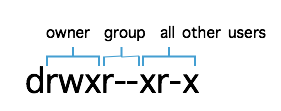

### Section 9: Essential Linux commands tutorial

Most HPC systems run Linux OS. So, our goal for this section is to learn the basics of Linux command line interface. 


**Linux OS**

There are two ways to interact with the Operating System (OS - software layer between hardware and software that manages memory, processes, files, and devices) - Graphical User Interface (**GUI**) and Command Line Interface (**CLI**). A GUI allows a user to click buttons to interact with files and executes a program, or drag and drop files. In comparision, a **Linux Shell** is a CLI that interprets the commands that the user types at the prompt (like `pwd`). 

**Terminal** is a user interface that allows user to input text and issue commands at the prompt that are interpreted by a Linux Shell. 

Programs that you write are either **compiled** language (C, C++ where you have a binary file that you can run on its own) or **scripting** files which are plain text (which why they are often called scripts) where you write a list of commands and you run through an interpreter which is shell. Shell reads the text file line by line and executes these commands. 

To see what shell you are running, type at the prompt:

```
$ echo $0

[Out:] -bash            
```

There are a few different shells. On most OS, **bash** is the default shell.

If you are running Mac or Linux, to find out what shells are installed on your system, type:

```
$ cat /etc/shells

[Out: ]  # Linux (Yeti)
#
# HEADER: This file is managed by Puppet
# HEADER: Do not modify directly!
#
###############################################################################
#
/bin/sh
/bin/bash
/sbin/nologin
/bin/zsh
/bin/tcsh
/bin/csh

[Out: ]   # Mac (local)
# List of acceptable shells for chpass(1).
# Ftpd will not allow users to connect who are not using
# one of these shells.

/bin/bash
/bin/csh
/bin/ksh
/bin/sh
/bin/tcsh
/bin/zsh
/usr/bin/dzsh
```


**Yeti file system**

The file system on Linux follows a basic tree structure with `/` directory as the root and all other directories inside that root directory. Note, a **folder** is an icon that only represents a **directory** on a file system. A directory is a file system structure. But most users use directory and folder interchangeably. 


You should be in the `/home/<username>` directory. Let's confirm by typing `pwd` command:

```
$ pwd     					     	# print working directory
```

Let's display the contents of this directory by typing `ls` command:

```
$ ls								# list directory contents
```

Other options to display the contents are:

```
$ ls -F   						# display a '/' to designate a directory (directory/)
$ ls -ltr						# display long listing with permissions, owner, size and 								 # date information
$ ls -ltr -G					# add colors to links and directories
$ ls -la  						# list one entry per line and display hidden files (.file)
```

Note, you can press up arrow to see previously typed commands (huge time saver!).

You should now see the long format listing (-l) of all (-a) the files in your directory including hidden files.

**Access rights** These are actions that are permitted on a file or directory.

- First letter indicates file type: `-` is a file; `d` stands for directory


- Owner permissions: read `r`, write `w` and execute `x` for the owner of the file
- Group members permissions: read `r`, write `w` and execute `x` for the owner of the file
- All other users permissions: read `r`, write `w` and execute `x` for the owner of the file



**Number of hard links** This number counts the number of child directories and files. This number includes the parent directory link (..) and current directory link (.)

**The username of the file's owner.** 

**The name of the group that owns the file.** 

**The size of the file in bytes.**

**The date & time that the file was last modified.**

**The name of the file or directory.**


To view available options and read about the command, type `man` to display the manual pages. Type `space` to scroll and `q` to exit the doc pages:

```
$ man ls     						# display help docs (space to scroll, q to exit)
```

If your screen gets messy, you can always clear it with `clear` command. On a Mac, you can also press `command` + `K` to clear the display.

```
$ clear (or command + K on Mac)   # clear display
```

You can navigate to a different directory with `cd` (change directory) command.

```
$ cd <directory> 				# change directory to a specified destination
$ cd /         					# change directory to a root directory
$ cd ..        					# go one level up
$ cd           					# change directory to home/<username>
$ cd ~							# change directory to home/<username>
```

Linux shell has tab completion so press `tab` to complete a command. 

We can make a new file with `touch` command.

```
$ touch test.txt                   # create a new file test.txt
```

To create a new directory, use `mkdir` command then list the contents of the directory:

```
$ mkdir data   				       # create new directory data
$ ls 
```

We can copy a file with `cp` command:

```
$ cp test.txt data.txt 			    # copy files
```

To rename a file, use `mv` command:

```
$ mv data.txt mydata.txt 			# rename or move files
```

You can also move a file to a different directory with `mv` command:

```
$ mv mydata.txt data/				# move data.txt file inside data/ directory
```

To create a symbolic link, use `ln` command:

```
ln -s data/mydata.txt  			    # make a symbolic link
```

To copy a directory that is not empty, add `-r` flag to indicate recursive copying of files and subdirectories inside that directory:

```
$ cp -r data/ data2				   # copy a directory
```

You can move a directory with `mv` command. If you specify the path where to move the directory, the directory is moved with the same name. Or alternatively, you can specify a new name to move the directory.

```
$ mv data2 data/					# move data2/ directory inside data/ directory
$ mkdir newdata
$ mv newdata data/mydata/			# move newdata directory inside data/ directory and 									# rename it mydata/
```

To remove a file, use `rm` command:

```
$ rm test.txt						# remove file
```

To remove a link, use `unlink` command:

```
$ unlink mydata.txt					# removes a link
```

To remove a directory that is not empty, use `-r` flag:

```
$ rm -r data                        # remove directory if directory is not empty
```

To display your user id and host system name, type:

```
$ whoami							# display user id
$ hostname							# display name of the host system
```

If you want to know where a program is located, you can type `which`:

```
$ which python							# locate a program in user's PATH
```

Let's navigate into `/home/nrapstine/hpc-101-webinar/examples` directory:

```
$ cd /home/nrapstine/hpc-101-webinar/examples
```

To display a file on the screen, use `cat` command. Alternatively, use `less` to display less information or `more` to display more. `less` and `more` allow you to scroll (by pressing `space`) and `q` to quit.

```
$ cat helloworld.py						# print file content to screen
$ less helloworld.py					# space to scroll, q to quit 
$ more helloworld.py
```

Similarly, if you want to only display the first few lines of a file, use `head` command.

```
$ head helloworld.py                    # display first few lines in a file
$ head -3 helloworld.py 				# display first 3 lines in a file
```

Or you can use `tail` command to display the last few lines of a file. Use `-n` flag to indicate how many lines you want displayed:

```
$ tail helloworld.py                    # dispaly last lines in a file
$ tail -3 helloworld.py  				# dispaly last 3 lines in a file
```

If you are writing a log file that is constantly being added new information as your program runs, you can use `tail -f` command to display it and append new data to the screen.

```
$ tail -f <file.out>					# display last lines of a file and append new data
```

The `echo` command outputs information to the screen. It is useful to display environmental variables such as $PATH. 

```
$ echo 'hello'							# display information to the screen
$ echo $PATH
```

If you want to see how many lines are in a file, use `wc -l` command (`wc` stands for word count, and `l` for lines):

```
$ wc -l helloworld.py                   # line count in input file
```

To change permissions of a file, use `chmod` command:

```
$ chmod   						# change permissions
```

To search for patterns, use `grep` command:

```
$ grep <pattern>				# search for patterns
$ grep size *                   # search for matching patterns "size" in current directory
```

To pipe output of one command to be the input to the next one, use piping `|`:

```
$ ls | head -3                   # piping output of ls command as input to head command
```

You can also redirect output to a file with `>` operator:

```
$ wc -l data.txt > test_output	 # redirects output to a file
$ ls
$ cat test_output
```

You can also append data to a file with `>>` operator:

```
$ ls >> test_output				 # append data to a file
$ cat test_output
```

To read data from a file, use `>` operator:

```
$ wc -l < test_output		# data from test_output file becomes input to wc -l command
```

We can combine reading from file `<` and outputting to a file `>` into a single command:

```
$ wc -l < test_output > my_output
$ cat my_output
```

If you want to see the commands that you typed, use `up arrow` to display previous commands or use `history` to display a log of commands:

```
$ history							# display history of typed commands
```

To untar a tar ball, 

```
$ tar -xvf file.tar				    # untar tape archive files
```

To change the prompt:

```
$ PS1='\W> '                        # change prompt
```

When you want to execute a program that is not in your $PATH, run that program with ./program as opposed to running python that is in your $PATH. You can verify that by typing `echo $PATH` and `which python`.

------

Go to Section 10: [Markdown](markdown.md)