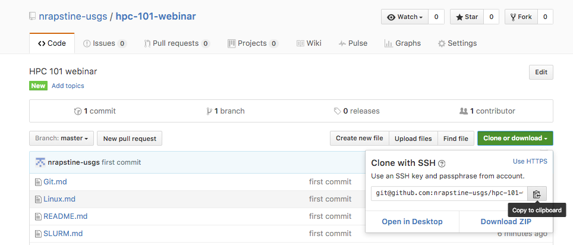

# HPC 101 webinar

### Section 1

To get started, Windows users need to first install [Git Bash](https://git-for-windows.github.io/).

- Follow the prompts
- Select "Use Git from the Windows Command Prompt"
- Select "Checkout Windows-style, commit Unix-style line endings"
- Select "Use Windows' default console window"
- Finish

After Git Bash is installed, launch Git Bash that will open a Command Prompt window. 


To get started, Mac users open a Terminal. To open a Terminal, press `command` + `space`, then type `term` and press `enter`. The Terminal window will pop up. You can customize your Terminal, by clicking on Terminal -> Preferences… (or alternatively, press `command` + `,`) to open up Preferences. There you can choose a profile that you like (make that Default to open up new Terminal window with that profile). 

In the Git Bash window (Windows) or Terminal (Mac) , type:

```
$ pwd
```

The command `pwd` stands for print working directory and it will display where you are in the directory structure.

To navigate to the directory where you would like the HPC tutorial repository to be. Use `cd` (change directory) command to move into a different directory. The `cd` command switches you into the directory that you specify, like so:

```
cd <directory name>
```

Type the command `ls` (list directory contents) this will show you what files are in your current working directory.  

Open a Browser and go to: [HPC 101 webinar GitHub repository](https://github.com/nrapstine-usgs/hpc-101-webinar) 

Click on the `Clone or download` icon, and switch to HTTPS copy by clicking `Use HTTPS` then press copy button.



Then in terminal, type the following Git command with the url that you just copied:

```
$ git clone https://nrapstine%40usgs.gov@my.usgs.gov/bitbucket/scm/arc/hpc-r-tutorials.git
```

Navigate into the git repository. You should now be inside the ***hpc-r-tutorials*** directory. To see the directory contents type the command ***ls*** and you should directories for ***cheat-sheets***, ***day1***, ***day2***, ***day3***,etc.


### **Markdown**

Markup language like LaTeX, XML, or HTML to easily distinguish between tags and text. But can be rendered as web page or pdf.

Wysiwyg (what you see is what you get) like Microsoft Office or Google Docs. While it is comfortable for writing, it is not geared toward adding in-line code or tags.

Markdown is sort of in between where you have tags but you also have wysiwyg environment that is very readable and writer friendly but you have the ability to add formatting, code snippets and links.

The editor that I recommend is [Typora](https://typora.io/). 

------

Go to Section 2: [Introduction to ARC at USGS](./intro)