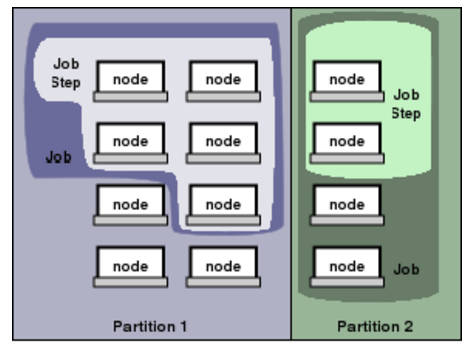

### Section 11: SLURM

#### Simple Linux Utility for Resource Management

SLURM is a resource manager and job scheduler for Yeti that

- allocates **resources** (compute nodes, memory, interconnect, GPU's, licenses) 
- launches and runs parallel jobs (on allocated nodes)
- manages a queue of jobs

A **job** is an allocation of nodes assigned to a user for some amount of time.

**Job steps** are sets of (possibly parallel) tasks within a job.



(Figure is from official SLURM documentation: https://slurm.schedmd.com/quickstart.html). A job on the left on Partition 1 uses all the nodes for a single job step while a job on Partition 2 has two independent job steps that use a portion of the allocated nodes.

Users submit jobs to a **shared system** that may run on one or multiple nodes, request the amount of resources needed and for how long. Jobs can be very large or many small jobs. SLURM will optimally distribute the jobs and manage the queue of jobs until resources are available.  


**User commands**

`sinfo`: report information about partitions and nodes. On Yeti you will see the partitions (UV, normal, long, and large), the availability (up or down), the maximum wall times, the number of nodes, the state of availability (alloc, idle, mix, etc.), and the list of node names.  

```
PARTITION AVAIL  TIMELIMIT  NODES  STATE NODELIST
large        up 3-00:00:00      1    mix n3-187
large        up 3-00:00:00     42  alloc n3-[145-186]
large        up 3-00:00:00     17   idle n3-[188-204]
normal       up 7-00:00:00     37    mix n3-[87-95,103,109-113,121-125,128-144]
normal       up 7-00:00:00     23  alloc n3-[85-86,96-102,104-108,114-120,126-127]
long         up 30-00:00:0     37    mix n3-[87-95,103,109-113,121-125,128-144]
long         up 30-00:00:0     23  alloc n3-[85-86,96-102,104-108,114-120,126-127]
UV           up 3-00:00:00      2    mix UV00000395-P001,UV00000437-P001
UV           up 3-00:00:00      1  alloc UV00000395-P002
```

|           |                                          |
| --------- | :--------------------------------------: |
| PARTITION |           Name of a partition            |
| AVAIL     |       Partition state: up or down        |
| TIMELIMIT | Maximum time limit for any user job in days-hours:minutes:seconds |
| NODES     | Count of nodes with this particular configuration |
| STATE     | State of the nodes. Possible states include: allocated (alloc), completing (comp), down (down), drained (drain), draining (drng), fail (fail), failing (failg), future (futr), idle (idle), maint (maint), mixed (mix), perfctrs (npc), power_down (pow_dn), power_up (pow_up), reserved (resv), and unknown (unk) |
| NODELIST  | Names of nodes associated with this configuration/partition |


`salloc`: allocate nodes for a job and launch a shell where a user executes `srun` command to run parallel tasks.

`sbatch`: submit a script (usually `file.slurm`) for execution (typically, the script has `srun` commands to run parallel tasks). Options are designated with `#SBATCH <options>`. 

```
$ sbatch <file.slurm>
```

`srun`: submit a job for execution or launch job steps

`sinteractive`: launches an interactive shell with X11 forwarding for SLURM.  

`squeue`: report the state of jobs currently located in the scheduling queue (running or pending). 

```
             JOBID PARTITION     NAME     USER ST       TIME  NODES NODELIST(REASON)
		   1804756    normal  r10u_KS    abock  R    3:23:50      1 n3-121
           1804750    normal   r05_KS    abock  R    3:24:20      1 n3-85
           1804752    normal   r07_KS    abock  R    3:24:20      1 n3-121
           1804748    normal   r03_KS    abock  R    3:24:51      1 n3-89
           1804749    normal   r04_KS    abock  R    3:24:51      1 n3-89
           1804747    normal   r02_KS    abock  R    3:25:21      1 n3-111
           1800788     large ATHAM_te ssolovit  R 1-04:27:37     43 n3-[145-187]
           1799358        UV   bayenv      koh  R 1-20:49:34      1 UV00000437-P001
           1798118    normal Sdi.a_Md   ejones  R 2-03:43:42      1 n3-132
           1797851    normal Sdd.a_Md   ejones  R 2-04:23:33      1 n3-89
           1797850    normal Sdd.a_Md   ejones  R 2-04:24:03      1 n3-89
           1797848    normal Sdi.g_Md   ejones  R 2-04:26:04      1 n3-86
           1797846    normal Sdd.g_Md   ejones  R 2-04:26:34      1 n3-86
           1797847    normal Sdd.g_Md   ejones  R 2-04:26:34      1 n3-86
           1797845    normal Sdi.ga_M   ejones  R 2-04:27:34      1 n3-85
           1797843    normal Sdd.ga_M   ejones  R 2-04:28:04      1 n3-85
           1797844    normal Sdi.ga_M   ejones  R 2-04:28:04      1 n3-85
           1797842    normal Sdd.ga_M   ejones  R 2-04:28:34      1 n3-111
           1776263      long  180mlc%    mtosa  R 4-06:10:34      8 n3-[114-121]
           1776262      long  180mlc%    mtosa  R 4-06:13:05      8 n3-[96-103]

```

|                   |                                          |
| ----------------- | :--------------------------------------: |
| JOBID             | Job id. This will have a unique value for each element of job arrays |
| PARTITION         |     Partition of the job or job step     |
| NAME              |           Job or job step name           |
| USER              |                 Username                 |
| ST                | Job Status: pending (PD), running (R), suspended (S), cancelled (CA), completing (CG), completed (CD), configuring (CF), failed (F), timeout (TO), preempted (PR), node_fail (NF) and special_exit (SE) |
| TIME              | Wall time that the job has been running  |
| NODES             |             Number of nodes              |
| NODELIST (REASON) | List of nodes or reason for job pending status |

If you want to learn more about the options for a SLURM command you can use the **--help** flag.

`squeue --help`: display documentation for each command with summary of options

`squeue -u <username> `: display all jobs for a specified user

`scancel`: cancel running or pending job 

`scancel -u <username>`: cancel all jobs for a specified user

`sidle`: report summary of what is currently running on the cluster.

```
PARTITION AVAIL  TIMELIMIT  NODES  STATE
large        up 3-00:00:00      1    mix
large        up 3-00:00:00     42  alloc
large        up 3-00:00:00     17   idle
normal       up 7-00:00:00     18    mix
normal       up 7-00:00:00     42  alloc
long         up 30-00:00:0     18    mix
long         up 30-00:00:0     42  alloc
UV           up 3-00:00:00      2    mix
UV           up 3-00:00:00      1  alloc

PARTITION CORES  HTTs JOBS  STATE     
large       416   416        idle  29%
normal       74    74        idle   6%
long         74    74        idle   6%
UV           21    21        idle   4%

large      6522       5083 pending
normal     6122       5134 pending
long       5232       5083 pending
UV         5082       5082 pending


JOBID     PART     NAME        TIME ST   TIME_LEFT     USER CPUS  NODES NODELIST(REASON)
```

`sidle -h`: to see options for sidle command.


**Required parameters** 

To run a job, you have to specify flags for "**partition, -p**," "**Account, -A**," and "**walltime, -t**".

Your account code can be found when you login to Yeti:

```
******************************************

   Yeti Cluster Info
             Account       User 
-------------------- ---------- 
                csas  nrapstine 
            training  nrapstine 
 _________________________________________ 
< Those are your available account codes. >
 ----------------------------------------- 
        \   ^__^
         \  (oo)\_______
            (__)\       )\/\
                ||----w |
                ||     ||

******************************************
```


#### Cancelling a Job

If you need to cancel a job, you can use the `scancel` command. You can use this command along with your username or a specific job id.  You can find your jobid from the output of the `sidle` command. If you make a mistake and need to kill all jobs under your username:

```
scancel -u <username>
```

or

```
scancel <jobid>
```

to kill an individual job.


#### Priority Reservations

if you have a demo, emergency data processing needs, or for some reason need priority in the queue, please contact us and we can create a reservation for you at `gs-css_csas_hpc_help@usgs.gov`.

------

Go to Section 12: [Loading modules on Yeti](modules.md)