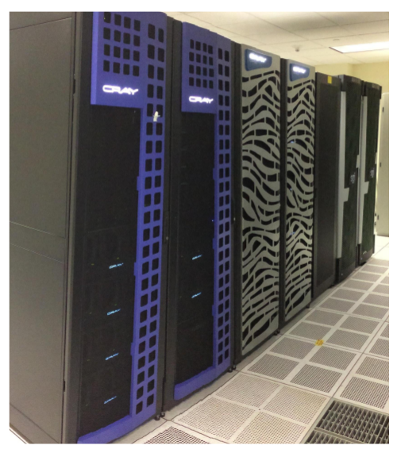

### Section 5: Yeti Architecture 

**Yeti** supercomputer at USGS:

#### Hardware

**Nodes** have **CPU's** (Central Processing Unit) and **GPU's** (Graphics Processing Unit) on them. 

A single CPU or **processor **is an individual silicon chip such as Intel Ivy Bridge or Intel Haswell with multiple **cores** on it. A **core** is an individual processor that executes programs.

- 123 Compute Nodes (38,590 Total Cores):
  - 3,152 CPU Cores (1,456 Intel Ivy Bridge cores and 1,696 Intel Haswell cores)
  - 366 Xeon Phi 7120P cores
  - 35,072 Cuda Cores (5,120 Quadro K2200 GPU cores and 29,952 Tesla K80 GPU cores)
- 23,824 GB Total RAM
- ~105 TFlop/s total combined performance 
- Node interconnect is InfiniBand (40-56 Gb/s)
- 793 TB Usable Storage
  - 508 TB [Lustre](http://lustre.org/about/) storage
  - 285 TB [CXFS](https://www.sgi.com/pdfs/4447.pdf) storage
- 12-14 GB/s Lustre throughput 
- 6.7 GB/s CXFS throughput 

#### Compute Nodes

**Distributed Memory System:**

- 60 [Cray CS300](http://www.cray.com/Assets/PDF/products/cs/CrayCS300-ACBrochure.pdf) Compute nodes (1200 CPU cores total)

  - 2x10 Cores [Intel "Ivy Bridge" E5-2660 v2 2.2GHz](http://ark.intel.com/products/75272/Intel-Xeon-Processor-E5-2660-v2-25M-Cache-2_20-GHz) CPUs meaning that there are 2 Ivy Bridge processors per node and each processor has 10 cores.
  - 128 GB RAM
  - 250 GB 7200 RPM disk drive
  - Single QDR (40 Gbps) InfiniBand connection
  - Single 1 Gbps (billions of bits per second) Ethernet connection

- 60 [Cray CS400](http://www.cray.com/sites/default/files/resources/CrayCS400-ACBrochure.pdf) Compute nodes (1440 CPU cores total)

  - 2x12 Cores [Intel "Haswell" E5-2690 v3 2.60GHz](http://ark.intel.com/products/81713/Intel-Xeon-Processor-E5-2690-v3-30M-Cache-2_60-GHz) CPUs meaning that there are 2 Haswell processors per node and each processor has 12 cores.

  - 128 GB RAM

  - 240 GB Solid State local disk

  - Single FDR (56 Gbps) InfiniBand Connection

  - Single 1 Gbps Ethernet Connection

    ​

**Shared Memory System:**

- 1 [SGI UV2000](https://www.sgi.com/pdfs/4552.pdf) Compute node (256 CPU cores and 5,120 Quadro GPU cores)
  - 32x8 Core [Intel "Ivy Bridge" E5-4627 v2 3.3Ghz](http://ark.intel.com/products/75287/Intel-Xeon-Processor-E5-4627-v2-16M-Cache-3_30-GHz) CPUs (there are 32 Ivy Bridge processors with 8 core each for the total of 256 CPU cores)
  - 4 TB RAM
  - 8 [NVidia Quadro K2200](http://images.nvidia.com/content/pdf/quadro/data-sheets/75509_DS_NV_Quadro_K2200_US_NV_HR.pdf) GPUs (5,120 GPU cores)
  - 1 x 10 Gbps Ethernet connection
  - 4 x 16 Gbps Fiber Channel connection
  - Single QDR InfiniBand connection
- 2 [SGI UV300](https://www.sgi.com/pdfs/4551.pdf) Compute nodes (256 CPU cores and 29,952 GPU cores and 366 Xeon Phi cores)
  - 8x16 Core [Intel "Haswell" E7-8867 v3 2.5Ghz](http://ark.intel.com/products/84681/Intel-Xeon-Processor-E7-8867-v3-45M-Cache-2_50-GHz) CPUs (128 total cores)
  - 2 TB RAM
  - 6 [NVidia Tesla K80 GPUs](http://www.nvidia.com/object/tesla-k80.html) w/ 4992 cuda cores each (29,952 total) - all six are on one UV300
  - 6 [Intel 7120P "Knight's Corner" Xeon Phi Co-processors](http://ark.intel.com/products/75799/Intel-Xeon-Phi-Coprocessor-7120P-16GB-1_238-GHz-61-core) w/ 61 cores at 1.238 GHz (366 total cores) - all six are on one UV300
  - 6 [2 TB Intel P3700 NVMe SSD](http://www.intel.com/content/www/us/en/solid-state-drives/solid-state-drives-dc-p3700-series.html) (12 TB total) for local scratch or short term use. These drives replace the use the ramdisk for local scratch on these systems. You now have all RAM available for computation.

#### Node Types

**Login nodes**

- This is where you are when you log in
- Not for heavy computation, interactive jobs, or long running processes

**Compute nodes**

- This is where you submit your jobs through the SLURM scheduler

- Intended for heavy computations

  ​

#### Yeti Storage

Yeti has four file systems shared by all nodes:

`/home` is an NFS (Network File System):

- Current capacity is 7 TB
- This is general storage, not performance oriented.
- Home directory is NOT for direct computation

`/cxfs/projects` is a direct CXFS mount on the UV system and NFS mounted on the normal and large partitions:

- Current capacity is 248 TB
- Powered by 3 NetApp 5660 disk arrays connected by 16Gbps Fiber Channel
  - Disks are 4TB 7200 RPM SATA drives
  - This area is designed for capacity and performance

`/cxfs/scratch` is a direct CXFS mount on the UV system and NFS mounted on the normal and large partitions:

- Current capacity is 36 TB
- Powered by an SGI IS5100 disk array connected by 16Gbps Fiber Channel
- Disks are 900G 10k RPM SAS drives
  - This area is the `$GLOBAL_SCRATCH` directory assigned when you get a job allocation on the UV systems. When running jobs on UV, temperary files are output here. Files are deleted after the job is done running.
  - Designed for high performance with moderate capacity

`/lustre` is directly mounted on all compute and login nodes through the InfiniBand Fabric:

- Current capacity is 508 TB
- Powered by a Cray Sonexion 900 Lustre system
- It has 1 MetaData Server MDS (with a standby MDS), 6 Object Storage Servers (OSSs), and 18 Object Storage Targets (OSTs)
- Lustre version is 2.0 (Cray NEO 1.5)
- OST disks are 4 TB 7200 RPM SATA drives
- 12-14 GB/s Lustre throughput - preliminary benchmark measured by [IOR](https://www.nersc.gov/users/computational-systems/cori/nersc-8-procurement/trinity-nersc-8-rfp/nersc-8-trinity-benchmarks/ior/)
- Designed for extremely high performance throughput
- This area is the `$GLOBAL_SCRATCH` directory assigned when you get a job allocation on the normal or large partitions. When running jobs on normal or large, temperary files are output here. Files are deleted after the job is done running.

------

Go to Section 6: [partitions on Yeti](partitions.md)