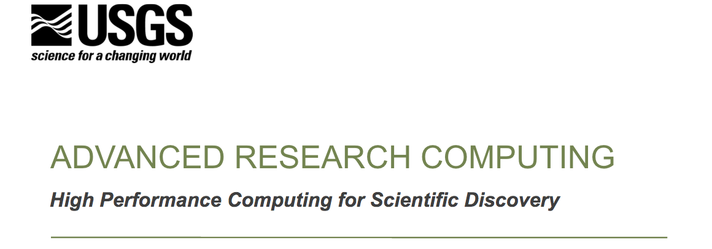
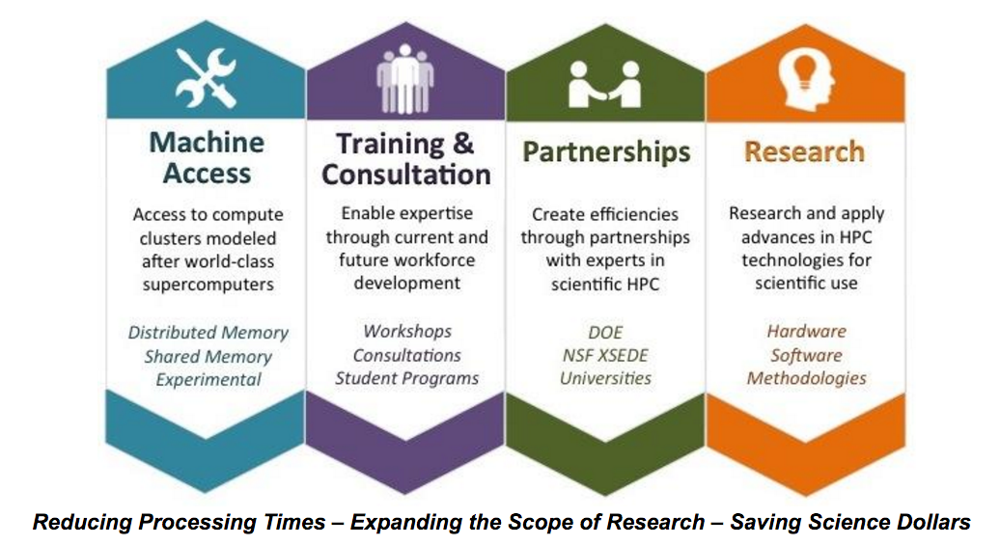
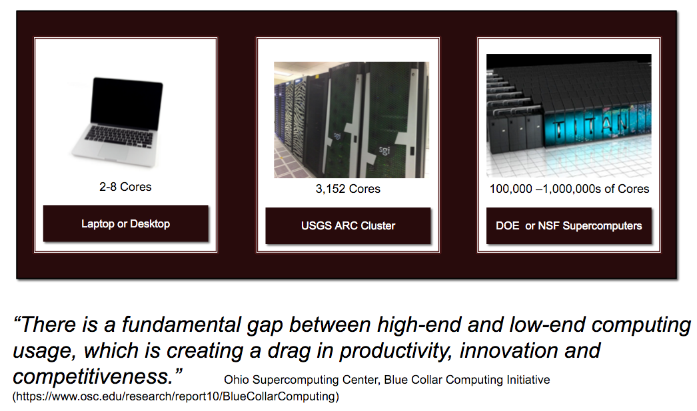
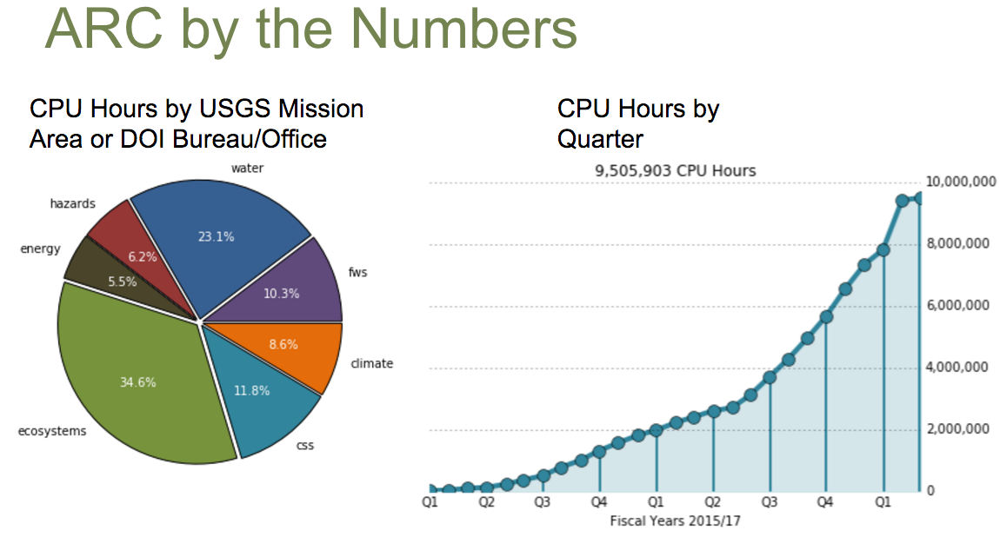

### Section 2: Introduction to ARC at USGS

For help, send us an email at `gs-css_csas_hpc_help@usgs.gov`

**Our team**:

- Janice Gordon : `janicegordon@usgs.gov`
- Jeff Falgout : `jfalgout@usgs.gov`
- Brad Williams: `bradwilliams@usgs.gov`
- Leon Foks: `nfoks@usgs.gov`
- Natalya Rapstine: `nrapstine@usgs.gov`

**Our goal:** provide high performance computing capabilities and expertise to USGS scientists for the acceleration and expansion of scientific discovery

**How we help scientists:**

**Consulting** - scientific programmers on staff with expertise in code optimization for HPC systems (Python, R, MATLAB, Fortran, C/C++)

**The missing middle:**

*A CPU Hour is equivalent to 1 hour's worth of work on a single CPU.

------

Go to Section 3: [why use Yeti supercomputer](./why-hpc)