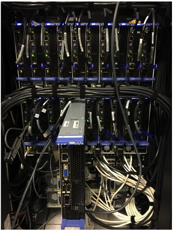

### Section 6: Partitions on Yeti

**Partitions** organize nodes into logical sets (possibly overlapping groups of nodes so that nodes can be in multiple partitions). Each partition has different constraints such as job time limit, job size limit, min CPU's required, and so on. 

#### **normal partition** 

Maximum wall time: 7 days. 

60 [Cray CS300](http://www.cray.com/Assets/PDF/products/cs/CrayCS300-ACBrochure.pdf) distributed memory compute nodes (1200 CPU cores total):

- each node has 2 x 10 core [Intel "Ivy Bridge" E5-2660 v2 2.2GHz](http://ark.intel.com/products/75272/Intel-Xeon-Processor-E5-2660-v2-25M-Cache-2_20-GHz) CPU's 

On Yeti, they are n3-[85-144].

#### UV partition

Maximum wall time: 3 days.

3 shared memory compute nodes (512 CPU cores and 35,072 GPU cores and 366 Coprocessor cores):

- 1 SGI UV2000 node (on Yeti, you will see this node as UV00000437-P001)
  - 32 x 8 core [Intel "Ivy Bridge" E5-4627 v2 3.3Ghz](http://ark.intel.com/products/75287/Intel-Xeon-Processor-E5-4627-v2-16M-Cache-3_30-GHz) CPU's (256 CPU cores)
  - 4 TB RAM
  - 8 [NVIDIA Quadro K2200](http://images.nvidia.com/content/pdf/quadro/data-sheets/75509_DS_NV_Quadro_K2200_US_NV_HR.pdf) GPU's with 640 CUDA cores (5,120 GPU cores)
- 2 SGI UV300 nodes (on Yeti, they are UV00000395-P001and UV00000395-P002)
  - 8 x 16 core [Intel "Haswell" E7-8867 v3 2.5Ghz](http://ark.intel.com/products/84681/Intel-Xeon-Processor-E7-8867-v3-45M-Cache-2_50-GHz) CPU's (256 CPU cores)
  - 2 TB RAM
  - 6 [NVIDIA Telsa K80](http://www.nvidia.com/object/tesla-k80.html) GPU's with 4,992 CUDA cores (29,952 GPU cores)
  - 6 [Intel Xeon Phi 7120P ("Knight's Corner")](http://ark.intel.com/products/75799/Intel-Xeon-Phi-Coprocessor-7120P-16GB-1_238-GHz-61-core) with 61 cores (366 Coprocessor cores)
  - 6 [2TB Intel P3700 NVMe SSD](http://www.intel.com/content/www/us/en/solid-state-drives/solid-state-drives-dc-p3700-series.html) (12 TB total) for local scratch or short term use. These drives replace the use the ramdisk for local scratch on these systems. You now have all RAM available for computation.

#### **large** partition

Maximum wall time: 3 days

Minimum CPU's required: 240 CPU's

60 [Cray CS400](http://www.cray.com/sites/default/files/resources/CrayCS400-ACBrochure.pdf) distributed memory nodes (1440 CPU cores):

- each node has 2x 12 core [Intel "Haswell" E5-2690 v3 2.60GHz](http://ark.intel.com/products/81713/Intel-Xeon-Processor-E5-2690-v3-30M-Cache-2_60-GHz) CPU's 

On Yeti, they are n3-[145-204].

#### **long** partition

Maximum wall time: 30 days

60 [Cray CS300](http://www.cray.com/Assets/PDF/products/cs/CrayCS300-ACBrochure.pdf) distributed memory compute nodes (1200 CPU cores total):

- each node has 2 x 10 core [Intel "Ivy Bridge" E5-2660 v2 2.2GHz](http://ark.intel.com/products/75272/Intel-Xeon-Processor-E5-2660-v2-25M-Cache-2_20-GHz) CPU's 

On Yeti, they are n3-[85-144].

------

Go to Section 7: [Linux/Command Line](Linux.md)