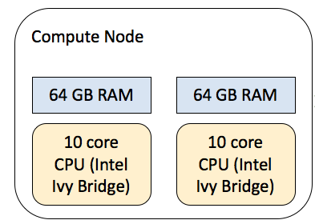
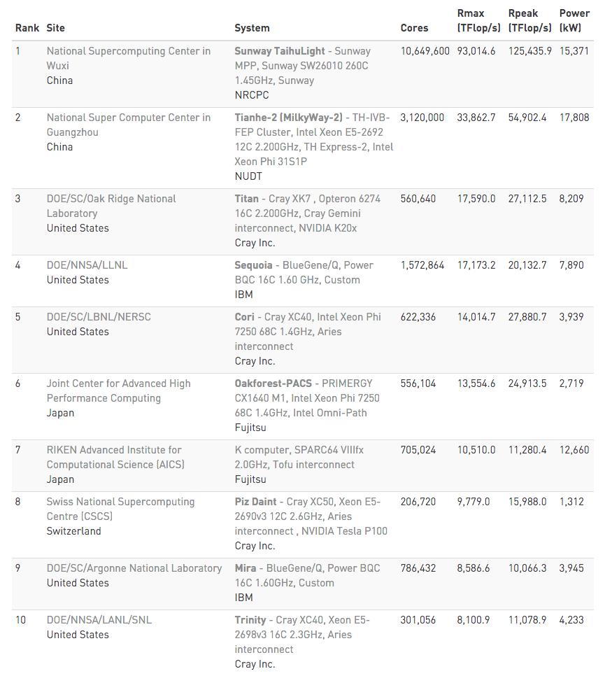
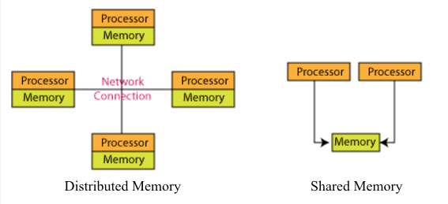

### Section 4: What is a supercomputer?

**High Performance Computing** (HPC) system has the following characteristics:

- Hardware (compute nodes, CPU's/GPU's, file storage, high speed network)
- Software (applications, schedulers, debugging tools)
- Programming languages (C, Fortran, Python, R, etc)
- Parallel programming paradigms (algorithms, shared memory parallelism, distributed memory parallelism)

**Supercomputer** is a computer cluster connected via high speed interconnects that is configured to function as a single computing resource.

Here is an image of **IBM's Blue Gene/P supercomputer** at Argonne National Laboratory:

Image from https://en.wikipedia.org/wiki/Supercomputer

Racks/cabinets house stacked blades with each blade having multiple compute **nodes**. Nodes refer to the physical machine/server. Each node has **processors** (**CPU's** - Central Processing Units and **GPU's** - Graphics Processing Units). Processors has multiple **cores**. Cores are individual computation unit on the CPU that carry out the instructions. For example, an individual Intel-based compute node has two 12-core CPU's.

Image from https://en.wikipedia.org/wiki/Blue_Gene. In the figure, Compute Chip is an individual node with 2 CPU's. Node card is also called a blade that holds 32 nodes. Thus, each cabinet has 1024 nodes with thousands of cores.

Nodes talk to each other via a **communication network** - for example, InfiniBand. 

The performance of a supercomputer is measured in Flops (floating-point operations per second) or more commonly, Tflops ("teraflop per second" = 1012 or one trillion floating-point operations per second). 

- The world's fastest supercomputer has 10+ million cores and performs at 93,014.6 Tflop/s (that is 93 thousand trillion calculations per second). 
- \#500 in the world benchmarked at 349.3 Tflop/s on 13,296 cores.
- In comparison, **Yeti supercomputer** performs at ~105 TFlop/s on 38,590 cores. 
- A regular PC can do 17 billion flops.

Here is the [list](https://www.top500.org/list/2016/11/?page=1) of world's fastest supercomputers (updated twice a year). Top 10 as of November 2016 are:

Image from https://www.top500.org/list/2016/11/?page=1

**Memory**

In a **distributed memory** system, each CPU has its own private memory. CPU's communicate via **interconnect** (high speed communications network) like InfiniBand and Ethernet.

In a **shared memory** system, CPU's share a single memory space.

Image from https://www.codeproject.com/Articles/19065/Begin-Parallel-Programming-With-OpenMP

Each CPU has **cache** memory that it has fast access to (fastest and smallest; typically 16-25 MB). But by memory, we usually mean **RAM** (random access memory) that is slower to access than cache but much faster than reading/writing from **disk** (slowest and largest; long-term storage). Programs and data that are currently in use are placed in RAM so that CPU can easily access them. 

In a distributed memory system, each CPU has 128 GB RAM while in shared memory system, RAM is 2-4 TB.

------

Go to Section 5: [Yeti architecture](./architecture)