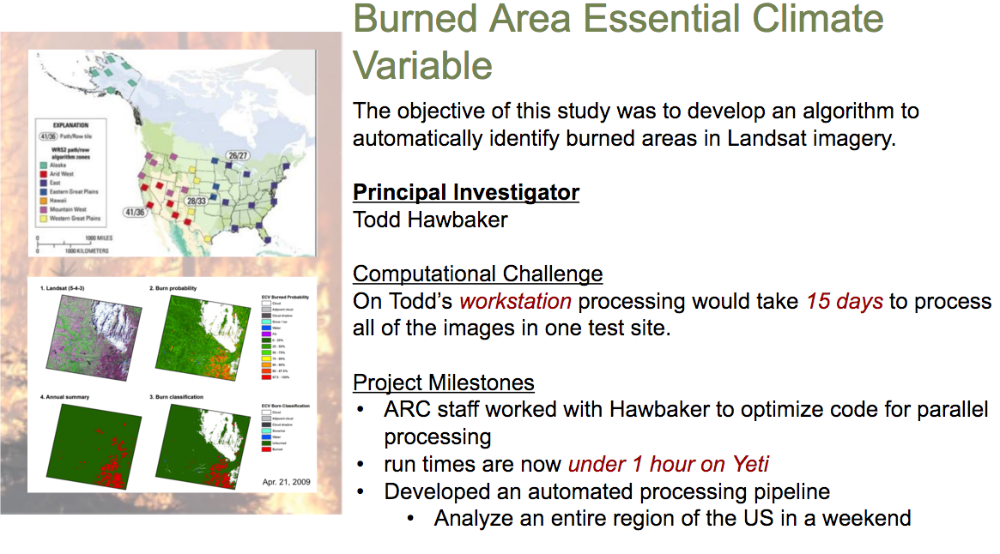
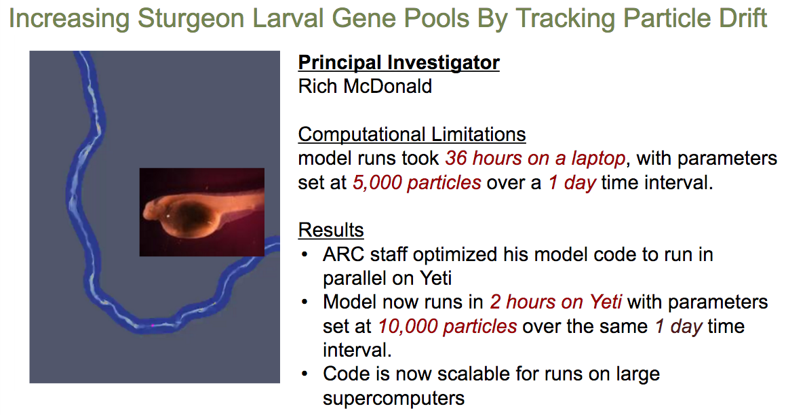
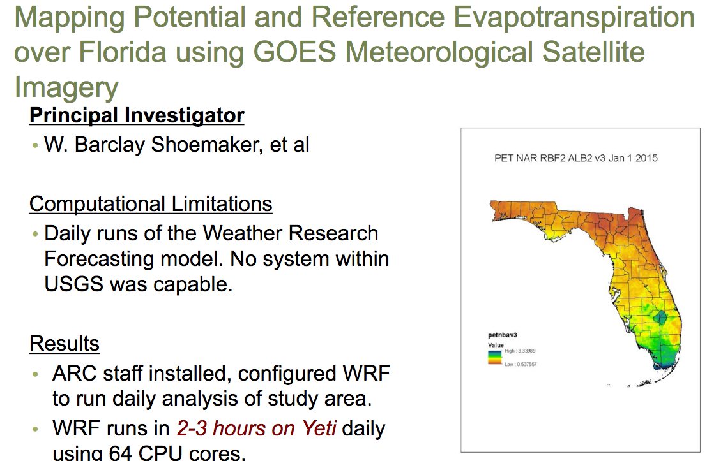
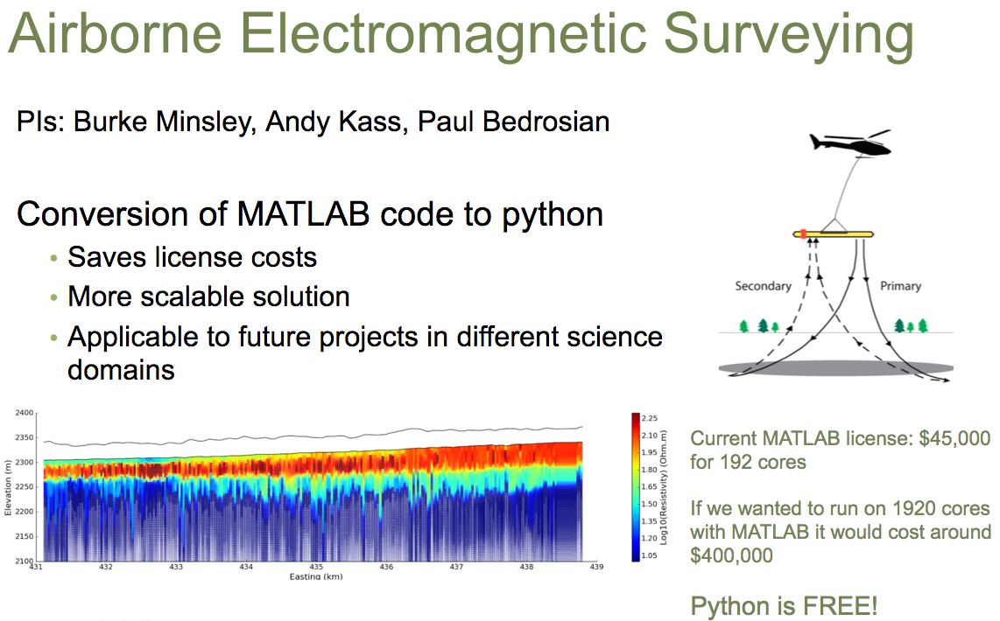
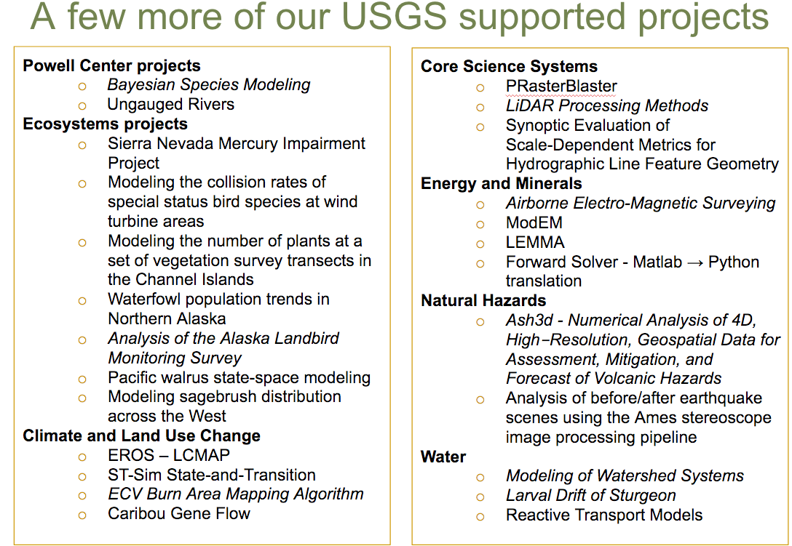
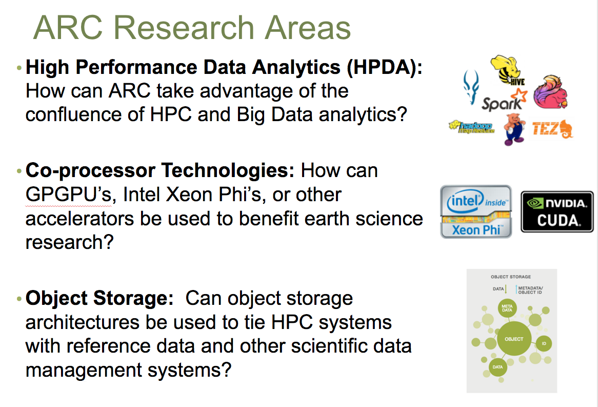

### Section 2: Motivation

#### Why use Yeti supercomputer?

Makes complex, large scale problems feasible. Programs that would have taken days or months or years to run on a desktop can now run in a matter of hours on Yeti cluster.

Applications include:

- Weather and Environmental modelling
- Geophysics
- Computational fluid dynamics
- Bioinformatics, genome sequencing

**Success Story #1:**

"Before working with the ARC team, it would take about 15 days to process all 410 images on my workstation!" 

~ Todd Hawbaker, Research Ecologist

**Success Story #2:**

"The holy grail would be to model 100 million particles over a 3 day time interval. Obtaining this project goal will require runs on top 500 supercomputers, such as Titan or XSEDE resources."

~ Rice McDonald, Research Hydrologist

**Success Story #3:**

**Success Story #4:**

------

Go to Section 3: [What is a supercomputer?](supercomputer.md)